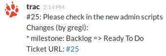

Trac Notifications for Slack
============================

[Trac](http://trac.edgewall.org/) has really nice email notifications for tickets:
```
#25: Please check in the new admin scripts
---------------------------+-------------------------
   Reporter:  gregi        |      Owner:  robert
       Type:  enhancement  |     Status:  new
   Priority:  major        |  Milestone:  Ready To Do
 Resolution:               |   Keywords:
Action Item:               |
---------------------------+-------------------------
Changes (by gregi):

 * milestone:  Backlog => Ready To Do


-- 
Ticket URL: [...]
```

Having those handy notifications on changes directly in [Slack](https://slack.com/) enhances productivity!




Installing
==========

On your machine running trac, add a ```slack``` user and save ```tracslack.py``` in his ```$HOME```.

Edit the ```.forward``` file of this user with this content:

    |/home/slack/tracslack.py


Finally, adjust your ```trac.ini``` and add the local slack user as an ```smtp_always_cc``` option.
    
     [notification]
     smtp_always_cc = slack@localhost

Configuration
=============
You need to setup an "Incoming Webhook" inside Slack. Afterwards set the ```SLACK_URL``` and ```SLACK_TOKEN```  inside tracslack.py:

    SLACK_URL="https://yourcompany.slack.com/services/hooks/incoming-webhook"
    SLACK_TOKEN="ABc293jBlPyktTIasdagasd"

Additionally, you can adjust the channel, username and even the emoji of the trac messages:

    SLACK_CHANNEL="#trac"
    SLACK_USERNAME="trac"
    SLACK_EMOJI=":rocket:"

Meta
====
Maintained by Gregor Dorfbauer [@dorfbauer](https://twitter.com/dorfbauer)

If you like those scripts, have a look at my startup [Usersnap](https://usersnap.com/?gat=github)
